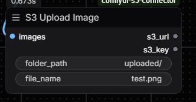
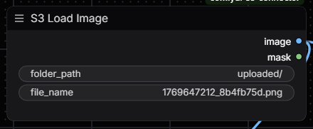

# ComfyUI S3 Connector

A ComfyUI custom node pack for seamless image uploading and downloading between local workflows and S3 buckets. Supports AWS S3 and S3-compatible services (MinIO, DigitalOcean Spaces, etc.).

## Installation

1. Clone this repository into your ComfyUI custom_nodes folder:
   ```bash
   cd ComfyUI/custom_nodes
   git clone https://github.com/your-repo/comfyui-s3-connector.git
   ```

2. Install dependencies:
   ```bash
   cd comfyui-s3-connector
   pip install -r requirements.txt
   ```

3. Configure S3 credentials:
   ```bash
   cp .env.example .env
   ```
   Edit `.env` and fill in your S3 credentials.

4. Restart ComfyUI

## Configuration

Copy `.env.example` to `.env` and configure the following:

| Variable | Required | Description |
|----------|----------|-------------|
| `S3_ACCESS_KEY_ID` | Yes | Your AWS/S3 access key |
| `S3_SECRET_ACCESS_KEY` | Yes | Your AWS/S3 secret key |
| `S3_BUCKET_NAME` | Yes | Target bucket name |
| `S3_REGION` | No | AWS region (default: us-east-1) |
| `S3_ENDPOINT_URL` | No | Custom endpoint for S3-compatible services |
| `S3_PREFIX` | No | Prefix path for all uploads |

## Nodes

### S3 Upload Image

Uploads images from your ComfyUI workflow to an S3 bucket.



**Inputs:**
- `images` (IMAGE): Image tensor from ComfyUI workflow
- `folder_path` (STRING): S3 folder path to upload to
- `file_name` (STRING): File name to save as

**Outputs:**
- `s3_url` (STRING): Full URL to the uploaded image
- `s3_key` (STRING): S3 key/path of the uploaded image

### S3 Load Image

Loads images from an S3 bucket into your ComfyUI workflow.



**Inputs:**
- `folder_path` (STRING): S3 folder path (e.g., `uploaded/`)
- `file_name` (STRING): File name to load (e.g., `image.png`)

**Outputs:**
- `image` (IMAGE): Image tensor for use in ComfyUI workflow
- `mask` (MASK): Alpha mask (if image has transparency)

### S3 Upload Image (Full Path)

Uploads images using a single full path string instead of separate folder and filename.

**Inputs:**
- `images` (IMAGE): Image tensor from ComfyUI workflow
- `full_path` (STRING): Complete S3 path including filename (e.g., `folder/subfolder/image.png`)

**Outputs:**
- `s3_url` (STRING): Full URL to the uploaded image
- `path` (STRING): S3 key/path of the uploaded image

### S3 Load Image (Full Path)

Loads images using a single full path string.

**Inputs:**
- `full_path` (STRING): Complete S3 path including filename

**Outputs:**
- `image` (IMAGE): Image tensor for use in ComfyUI workflow
- `mask` (MASK): Alpha mask (if image has transparency)

### Get Job ID

Returns the unique job/prompt ID for the currently running ComfyUI workflow. Useful for tracking outputs, organizing files by job, or logging.

**Inputs:**
- None (uses hidden ComfyUI context)

**Outputs:**
- `job_id` (STRING): The unique identifier for the current job/prompt execution

**Notes:**
- The node automatically refreshes on each queue to ensure you get the current job ID
- Can be connected to filename inputs to organize S3 uploads by job

## Usage Examples

### Upload workflow output to S3
1. Connect your image output to the **S3 Upload Image** node
2. Set a filename prefix (e.g., "generated_art")
3. Optionally set a custom path (e.g., "portraits/2024")
4. Run the workflow - images will be uploaded to your S3 bucket

### Load image from S3 for img2img
1. Add an **S3 Load Image** node
2. Enter the S3 key (e.g., "images/reference.png")
3. Connect the output to your workflow (KSampler, ControlNet, etc.)

## S3-Compatible Services

This plugin works with any S3-compatible storage service:

- **AWS S3**: Leave `S3_ENDPOINT_URL` empty
- **MinIO**: Set `S3_ENDPOINT_URL=http://localhost:9000`
- **DigitalOcean Spaces**: Set `S3_ENDPOINT_URL=https://nyc3.digitaloceanspaces.com`
- **Cloudflare R2**: Set `S3_ENDPOINT_URL=https://<account-id>.r2.cloudflarestorage.com`

## License

MIT License - See LICENSE file for details.
